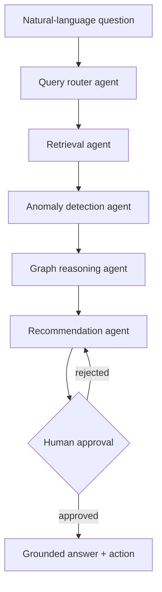
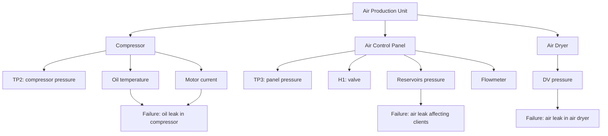
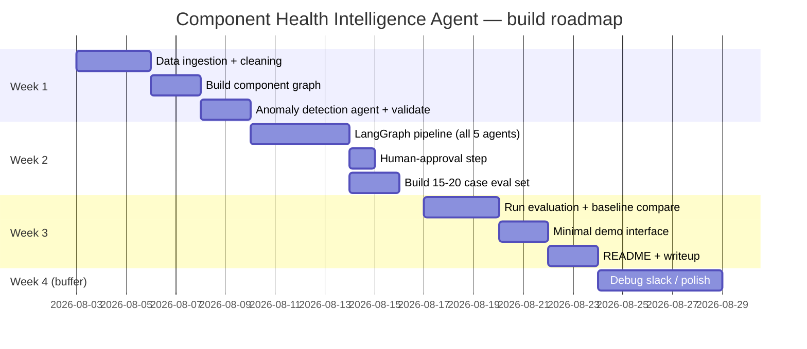

# Component Health Intelligence Agent — complete project roadmap

*A multi-agent, graph-reasoning diagnostic system for industrial equipment monitoring. Built for Eya's job search, using the same architecture pattern as the team's Supply Chain Disruption Agent (multi-tier graph traversal + quantified impact + human-approved action), applied to a real public predictive-maintenance dataset.*

---

## 1. The problem, in plain terms

Industrial equipment throws off huge volumes of sensor data. When something starts drifting, an engineer has to notice it, figure out which physical subsystem that implicates, judge how serious it is, and decide what to do — today, that's manual work, or at best a flat anomaly alert ("sensor X is out of range") that doesn't answer the question that actually matters: *what's failing, how bad is it, and what should happen next?*

This project builds a system that closes that gap: ask it a plain-English question about the equipment, and it reasons its way from raw sensor data to a specific, evidenced diagnosis and a drafted recommendation — not just a flagged number.

## 2. Why this project, for this purpose

Real junior AI/ML job postings in Germany ask for three things this project directly proves: genuine multi-agent orchestration (not single-turn retrieval), a designed evaluation framework with real metrics and test sets, and production-aware system thinking. It also directly upgrades the weakest-evidenced line on Eya's current CV — her RAG experience is described as a single-turn "chatbot plugin"; this is concrete proof of multi-step agentic reasoning, which is currently the fastest-growing, highest-paid skill cluster in the market.

## 3. The dataset — MetroPT (Air Production Unit, Porto Metro)

Real sensor data from the Air Production Unit (APU) of an operational metro train in Porto, Portugal — not simulated. The APU controls train door operation and platform-level raising/lowering, so its failure takes the train out of service; a genuinely consequential system to monitor.

**Sensors** (real, documented, mapped to physical modules):

| Sensor | Measures | Module |
|---|---|---|
| TP2 | Compressor pressure (bar) | Compressor |
| Oil_Temperature | Oil temperature (°C) | Compressor |
| Motor_Current | Motor current draw (A) | Compressor |
| TP3 | Pneumatic panel pressure (bar) | Air Control Panel |
| H1 | Valve activation above 10.2 bar | Air Control Panel |
| Reservoirs | Air tank pressure (bar) | Air Control Panel |
| Flowmeter | Airflow (m³/h) | Air Control Panel |
| DV_pressure | Pressure drop during air-dryer discharge (bar) | Air Dryer |

**Real documented failures** (from the dataset's own failure reports, used as ground truth): air leaks in the air dryer, air leaks affecting downstream clients, and oil leaks in the compressor, each with real logged start/end timestamps.

This is far less tutorial-saturated than the commonly-used NASA turbofan dataset, and the subsystem story is genuinely richer — three distinct physical modules (Compressor, Air Control Panel, Air Dryer) each with their own sensor signatures and failure modes, which is exactly what the graph-reasoning layer needs to be real rather than decorative.

## 4. System architecture

**Query router** — parses the question, identifies which sensors/time window/module it concerns.
**Retrieval agent** — pulls the relevant sensor time-series slice.
**Anomaly detection agent** — runs real anomaly detection (rolling z-score / trend deviation against the unit's own baseline) and flags abnormal sensors.
**Graph reasoning agent** — traverses the component graph from flagged sensors to the implicated module and likely failure type, with a severity/confidence estimate.
**Recommendation agent** — drafts a maintenance action; nothing is finalized without human approval, mirroring the same human-in-the-loop pattern as the Supply Chain Agent's RFQ queue.

## 5. The component graph

This is what the graph reasoning agent actually traverses — a flagged sensor (say, rising oil temperature) points up to its module (Compressor) and across to its documented failure type (oil leak), the same "trace the propagation" logic as the Supply Chain Agent's supplier-to-product traversal, just applied to a physical system instead of a supply network.

## 6. Evaluation methodology

Ground truth already exists in the data — the real logged failure events with real timestamps — so nothing needs to be invented.

- **Build 15-20 labeled diagnostic test cases**: for a given time window, what's the correct module and failure type, per the dataset's own failure reports?
- **Diagnosis accuracy** — did the agent correctly identify the failing module/failure type?
- **Retrieval precision** — did it pull the correct sensor/time window for the question?
- **Baseline comparison (the real contribution)** — run the same test set against a naive single-shot agent (raw sensor data dumped into an LLM once, no graph, no tools) and report the gap. This comparison is the evidence that the structured pipeline is doing genuine work, not decoration.

## 7. Roadmap

Realistic total: **3-4 weeks part-time**, with week 4 as genuine contingency rather than padding — the anomaly-detection tuning and pipeline debugging are the parts most likely to need it.

## 8. Team split

- **Hamza** — component graph, anomaly detection agent, evaluation harness (direct reuse of Supply Chain graph-reasoning skills).
- **Eya** — LangGraph orchestration, agent prompts/reasoning logic, demo interface (natural extension of her existing production LLM/RAG work at Wölfel).

## 9. Deliverable and CV framing

A repo with a README that states plainly: *"Agentic diagnostic system over real industrial sensor data (Porto Metro Air Production Unit), using graph-based reasoning and LangGraph multi-agent orchestration, evaluated against real documented failure events with [X]% diagnosis accuracy, benchmarked against a naive single-shot baseline."*

**Framing discipline**: lead with the system, not the dataset. The headline is "multi-agent diagnostic reasoning system," not "predictive maintenance on MetroPT" — the architecture is the differentiator, the dataset is just the evidence base.

## 10. Risks, stated honestly

- **Sensor-to-module mapping is grounded in the dataset's own documentation**, but severity thresholds (how abnormal is "abnormal") require some judgment calls — document them explicitly rather than presenting them as certain.
- **Small number of real failure events** in the dataset means the eval set will be modest — 15-20 cases is realistic, not a large-scale benchmark, and that should be stated plainly rather than oversold.
- **Scope discipline**: get the full pipeline working end to end on the core failure types before trying to generalize further — same "protect the core, cut the polish" discipline as the Supply Chain roadmap.

## 11. Skill development

Multi-agent orchestration with a human-approval interrupt, graph-based reasoning applied to a second domain (proof the architecture pattern generalizes, not a one-off), real evaluation against genuine ground-truth failure events, and a defensible baseline comparison — all directly legible to real data scientist/ML engineer job postings.
