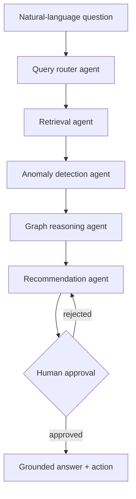
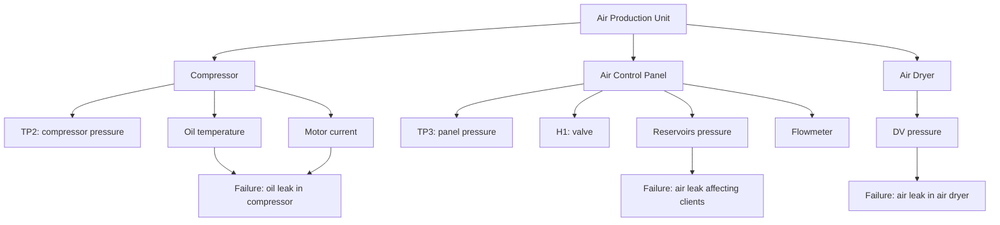

# FaultLens — Component Health Intelligence Agent

A multi-agent, graph-reasoning diagnostic system for industrial equipment monitoring. Ask a plain-English question about equipment sensor data, and the system routes the query, detects anomalies, traces them through a component hierarchy graph to identify the likely failing subsystem, and drafts a maintenance recommendation for human approval.

## The problem

Industrial equipment produces huge volumes of sensor data. When something drifts, an engineer has to notice it, figure out which subsystem it implicates, judge severity, and decide what to do — today that's manual, or at best a flat alert ("sensor X is out of range") that doesn't answer what actually matters: what's failing, how bad is it, and what should happen next.

## The dataset

**MetroPT** — real sensor data from the Air Production Unit (APU) of an operational metro train in Porto, Portugal. Not simulated.

| Sensor | Measures | Module |
|---|---|---|
| TP2 | Compressor pressure (bar) | Compressor |
| Oil_Temperature | Oil temperature (°C) | Compressor |
| Motor_Current | Motor current draw (A) | Compressor |
| TP3 | Pneumatic panel pressure (bar) | Air Control Panel |
| H1 | Valve activation above 10.2 bar | Air Control Panel |
| Reservoirs | Air tank pressure (bar) | Air Control Panel |
| Flowmeter | Airflow (m³/h) | Air Control Panel |
| DV_pressure | Pressure drop during air-dryer discharge (bar) | Air Dryer |

Ground truth comes from the dataset's own documented failure reports (real logged air leak / oil leak events with start/end timestamps).

## Architecture

- **Router** — parses the question, identifies the relevant time window/module.
- **Retrieval** — pulls the relevant sensor slice.
- **Anomaly detection** — rolling z-score per sensor, window tuned to the compressor's measured ~20-minute duty cycle.
- **Graph reasoning** — traces flagged sensors to a subsystem and likely failure type via the component graph.
- **Recommendation** — drafts a maintenance action; nothing is final without human approval.

## Component graph

## Evaluation

- 15-20 labeled diagnostic test cases, built from the dataset's real documented failures plus negative controls.
- **Diagnosis accuracy** — correct module/failure type vs. ground truth.
- **Retrieval precision** — correct sensor/time window pulled for the question.
- **Baseline comparison** — same test set run through a naive single-shot LLM (no graph, no tools), gap reported as evidence the structured pipeline does real work.

## Team split

- **Hamza** — component graph, anomaly detection agent, evaluation harness.
- **Eya** — LangGraph orchestration, agent prompts, demo interface.

## Known limitations

- Anomaly severity naturally decays during long, sustained faults, since the rolling baseline gradually adapts to the ongoing abnormal readings. A two-pass baseline-freezing fix was attempted but introduced a division-by-near-zero issue on low-variance sensors; a more robust fix (per-sensor-scaled epsilon, or explicit handling of frozen baselines) is a natural v2 extension.
- Sensor-to-module mapping is grounded in the dataset's own documentation, but severity thresholds required some judgment calls, documented in code comments.
- The eval set is modest (15-20 cases) given how few real documented failures exist in the data — a deliberate, stated tradeoff, not a large-scale benchmark.

## Framing

This is a multi-agent diagnostic reasoning system — the architecture is the point, MetroPT is just the evidence base it's validated against.
